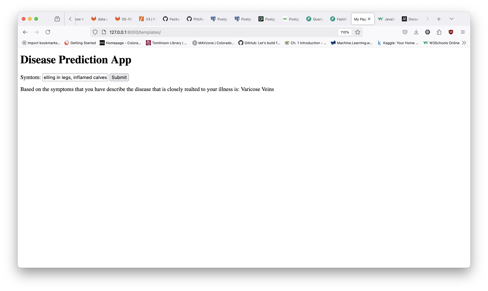

# CSCI 425 - Python Machine Learning

Repository for semester final project

## Application

Simple fastapi application that just uses html, css, and javascript for displaying the results.

Below is the application in its current working state




## Application Step-by-step Running Guide

Below is the simple steps that are needed to run that actual application. This is assuming that there is an existing virtual environment already setup and the requirements.txt file has been imported. If not please create a virtual environment to run the actual application.

1. To run the application simply navigate to the app sub folder if you are in the main directory and run the following command

   ```bash
   ~$ python main.py
   ```

This should show something similar to this ouput

picture here


2. Once that is completed you can navigate to localhost:8000/templates and it will display the application.

application picture
