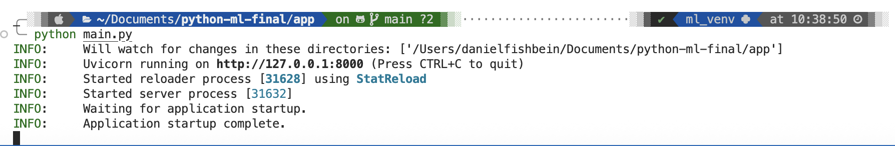
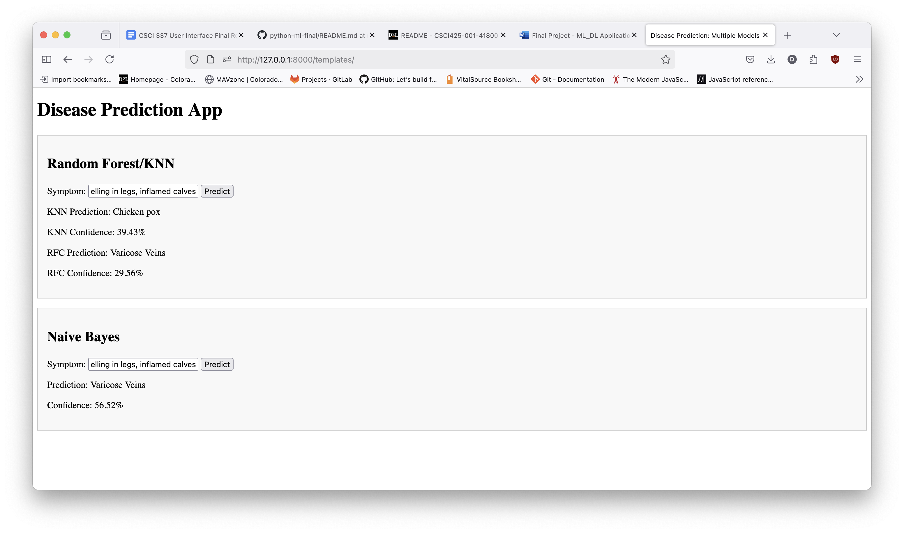

# CSCI 425 - Python Machine Learning

Repository for semester final project

## Application

Simple fastapi application that just uses html, css, and javascript for displaying the results.

Below is the application in its current working state


## Application Step-by-step Running Guide

Below is the simple steps that are needed to run that actual application. This is assuming that there is an existing virtual environment already setup and the requirements.txt file has been imported. If not please create a virtual environment to run the actual application.

1. To run the application simply navigate to the app sub folder if you are in the main directory and run the following command

   ```bash
   ~$ python main.py
   ```

This should show something similar to this ouput




2. Once that is completed you can navigate to localhost:8000/templates and it will display the application.



3. From there text can be inserted into the available locations and will provide a prediction for the implemented models, as well as, how confident said models are on that prediction.


## If No Virtual Envrionment

Here are some quick instructions to get a virtual environment setup in the root directory to use the application above.

1. Use the following command and change <your_env_name> to whatever name you choose.

   ```bash
   ~$ python3 -m venv <your_env_name>
   ```
Though this command works on a MacOS doesn't mean it works all the time. The command could be different on your machine so do keep that in mind if errors start to come up.

2. The above command should have created a separate file that has all the virtual environment tools needed. Next to activate the venv you simply can run this command

   ```bash
   ~$ source <your_env_name>/bin/activate
   ```
Once the above command is ran you should see something similar to the below image (terminals vary in how they look so when you do the above command it might not show exactly like this but as long as there is the name of the virtual environment then it should be good to go).


3. To deactivate the virtual environment simply type in this comman

   ```bash
   ~$ deactivate
   ```
This should stop the currently running virtual environment.
